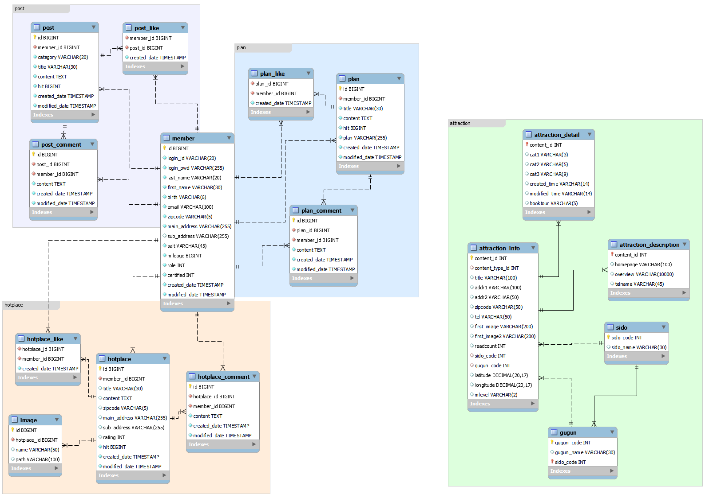

# ⛺ FAR AWAY 🚢

## ✅ Project Overview
 사용자 기반 추천을 통해 한국의 다양한 관광지, 먹거리, 축제, 행사 등을 검색할 수 있는 추천 기반 지역 관광 소개 페이지 
- '지역별 여행지' 에서 원하는 지역과 관광지 유형을 선택하면, 해당 지역의 관광정보를 제공해요.
- '나의 여행계획'를 통해 나만의 여행 꿀팁을 공유할 수 있어요.
- '핫플 자랑하기'를 통해 내가 발견한 🔥핫플레이스를 자랑해보아요!
- '여행정보 공유'를 통해 회원끼리 유용한 정보를 나눌 수 있어요.

## ✅ Team INFO 
멋쟁이 팀원들을 소개할게요. 😊
### 🐷 최영환 
- GitHub: [longBright](https://github.com/longBright)
### 🐯 장유진
- GitHub: [yoojinjangjang](https://github.com/yoojinjangjang)
### 🙈 전인혁
- GitHub: [wjs5025](https://github.com/wjs5025)
### 🐼 홍진식
- GitHub: [jinsikhong](https://github.com/jinsikhong)

## ✅ ERD

## ✅ 기본 기능
### ✔ 메인 화면 
 - Far Away 사이트의 추구하는 목적과 세부 설명을 담고 있으며, 빠르게 지역정보를 검색할 수 있는 버튼인 `Search Place` 를 제공함으로써 사용자의 UX를 고려한 메인페이지 입니다. 

### ✔ 로그인 화면
- ID와 PASSWORD 를 입력한 후 로그인 기능을 제공하는 페이지입니다. 
- 로그인 시 아이디 저장을 통해 자신의 아이디를 저장할 수 있습니다. 

### ✔ 회원가입 화면
- 회원정보를 입력한 후 회원가입을 진행할 수 있는 페이지입니다. 
- 회원의 아이디가 이미 등록되어 있는 중복 검사가 가능합니다. 
- 회원이 작성한 비밀번호와 비밀번호 확인에 입력한 두 비밀번호의 일치 여부 확인이 가능합니다. 
- 

### ✔ 마이페이지 화면

## ✅ 관광지 검색 기능
### ✔ 관광지 검색 화면

## ✅ 여행 경로 공유 기능
### ✔ 여행 경로 등록 화면

### ✔ 여행 경로 전체 조회 화면

### ✔ 여행 경로 상세 조회 화면

### ✔ 여행 경로 수정 화면

## ✅ 게시글 기능 
### ✔ 게시글 등록 화면

### ✔ 게시글 전체 조회 화면

### ✔ 게시글 상세 조회 화면

### ✔ 게시글 수정 화면

## ✅ 핫플레이스 기능
### ✔ 핫플레이스 등록 화면

### ✔ 핫플레이스 전체 조회 화면

### ✔ 핫플레이스 상세 조회 화면

### ✔ 핫플레이스 수정 화면 

